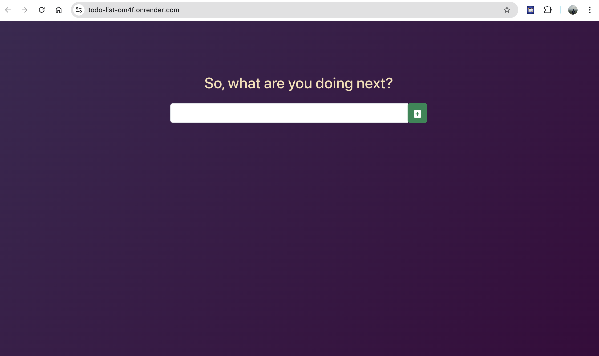
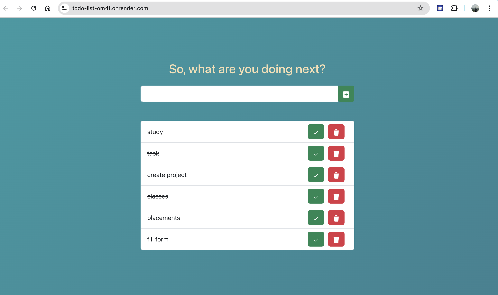

# todo-list

## Introduction

Welcome to the **todo-list** project! This is a simple and intuitive todo list application built with React. It allows users to add, remove, and mark tasks as complete. The project demonstrates the use of React for building dynamic web applications and showcases essential features like task management and state handling.

## Languages and Frameworks Used

- **JavaScript**: The programming language used for building the application.
- **React**: A JavaScript library for building user interfaces.
- **HTML/CSS**: For structuring and styling the application.
- **Node.js**: Server environment used during development.
- **Webpack**: Module bundler used for packaging the application.

## How to Start the Project

### Prerequisites

Ensure you have the following installed on your system:
- [Node.js](https://nodejs.org/) (v16 or v18 recommended)
- [npm](https://www.npmjs.com/) (comes with Node.js)

### Installation

 1. **Clone the Repository**
```bash
   git clone https://github.com/Pranav23Arora/todo-list.git
```
2. **Navigate to Project Directory**

```bash
    git clone https://github.com/Pranav23Arora/todo-list.git
```
3. **Install Dependencies**
```bash
    npm install
```
### Running the Project Locally

1. **Set Environment Variables**

To avoid errors related to OpenSSL, set the environment variable:

```bash
    export NODE_OPTIONS=--openssl-legacy-provider
```
2. **Start the Development Server**

```bash
    npm start
```
This will start the development server and open the application in your default browser at http://localhost:3000.

## Screenshots

Here are some screenshots of the application:


  


## Deployed Application

You can access the live version of the application at:

[https://todo-list-om4f.onrender.com/](https://todo-list-om4f.onrender.com/)

## Contributing

If you'd like to contribute to this project, please fork the repository and submit a pull request. Make sure to follow the project's coding style and include tests for any new features.

Steps to contribute:

1. **Fork the Repository**: Click the "Fork" button at the top right of the repository page.
2. **Clone Your Forked Repository**:

```bash
    git clone https://github.com/your-username/todo-list.git
```

## Author

**Pranav Arora**

- [GitHub Profile](https://github.com/Pranav23Arora)


